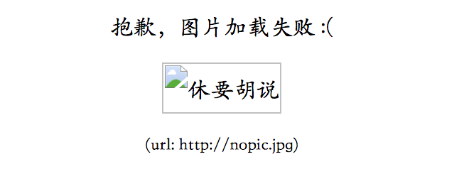
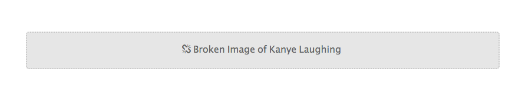

在各种浏览器中，当``标签的`src`属性为空或者当`src`所链接的地址图片加载失败的时候，会出现一个边框或者加载失败的提示样式，其中`IE`和`Chrome`各不相同，`Firefox`没任何提示，像这个元素不存在一样（版本52.0）。

<!--more-->




你可以在各大浏览器中查看下面加载失败的提示： 
  


   

其实，我们可以通过`JavaScript`和`CSS`来实现自定义出现这种情况的样式，提供更好的体验。

### 关于``标签需要知道的两点
- 字体样式也适用于``标签，但是这些样式将用于破裂图片的替代文字，不会影响正常显示的图片。
- ``标签是**[替换元素](https://developer.mozilla.org/zh-CN/docs/Web/CSS/Replaced_element)**，即其外观和尺寸由外部资源定义，所以在通常情况下`::before`和`::after`这两个伪元素都不起作用，一旦图片**加载失败**时这两个伪元素才会起作用。
   
  
### 采用`JavaScript`解决方案
在`Web API`接口中提供了一个`GlobalEventHandlers`的接口，这个接口包含一个`error`事件，当一项资源（如``或`<script>`）加载失败，加载资源的元素会触发一个`Event`接口的`error`事件，并执行该元素上的`onerror()`处理函数。这些`error`事件**不会**向上冒泡到`window`，不过能被单一的`window.addEventListener`捕获。因此，我们可以监听``上的该事件，当加载失败时候定义自己的样式，可以用一张提示图片替换，或者其他的处理。

```javascript
var images = document.getElementsByTagName("img");
for (i = 0; i < images.length; i++) {
    var img  = images[i];
    img.onerror = function () {
        //删除该元素
        //也可也放入其他处理逻辑
        img.parentNode.removeChild(self);
    }
}
```

   
### 采用`CSS`解决方案
如果不想显示加载错误的提示，可以隐藏。

- 当图片地址为空时，其实可以简单的隐藏

```css
img[src=""]{
    opacity: 0;
    visibility: hidden;
}
```

- 可以巧妙的设置图片的大小比其父元素宽高各大`2px`, 并设置其父元素`overflow:hidden`,同时设置``的`margin:-1px`。

```html
 <span class="image-container">
    
  </span>
```

```css
.image-container{
      width:100px;
      height:100px;
      overflow:hidden;
      display:block;
    }
.image-container img{
    width:102px;
    height:102px;
    margin:-1px;
}
```
   
要采用自定义加载提示样式，可以采用`::before`和`::after`实现。如果图片加载成功，则图片正常显示，伪元素的样式不会起作用，当加载失败是，会应用这些样式。下面的例子都采用以下`html`。

```html
  
```

- 添加一些有用的提示，如下：
   
   
   

```css
img {  
  font-family: 'Helvetica';
  font-weight: 300;
  line-height: 2;  
  text-align: center;

  width: 100%;
  height: auto;
  display: block;
  position: relative;
}

img:before {  
  content: "We're sorry, the image below is broken :(";
  display: block;
  margin-bottom: 10px;
}

img:after {  
  content: "(url: " attr(src) ")";
  display: block;
  font-size: 12px;
}
```
   
- 更改提示样式（使用了[Font Awesome](http://fontawesome.io/)）
   

 

```css
img { /* Same as first example */ }

img:after {  
  content: "\f1c5" " " attr(alt);

  font-size: 16px;
  font-family: FontAwesome;
  color: rgb(100, 100, 100);

  display: block;
  position: absolute;
  z-index: 2;
  top: 0;
  left: 0;
  width: 100%;
  height: 100%;
  background-color: #fff;
}
```
   
- 还可以添加一些额外的信息，如下：
   
   
   
```css
img {  
  /* Same as first example */
  min-height: 50px;
}

img:before {  
  content: " ";
  display: block;

  position: absolute;
  top: -10px;
  left: 0;
  height: calc(100% + 10px);
  width: 100%;
  background-color: rgb(230, 230, 230);
  border: 2px dotted rgb(200, 200, 200);
  border-radius: 5px;
}

img:after {  
  content: "\f127" " Broken Image of " attr(alt);
  display: block;
  font-size: 16px;
  font-style: normal;
  font-family: FontAwesome;
  color: rgb(100, 100, 100);

  position: absolute;
  top: 5px;
  left: 0;
  width: 100%;
  text-align: center;
}
```
   
### 参考
[Styling Broken Images](https://bitsofco.de/styling-broken-images/?utm_source=CSS-Weekly&utm_campaign=Issue-206&utm_medium=web)
