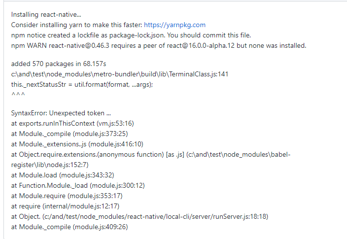
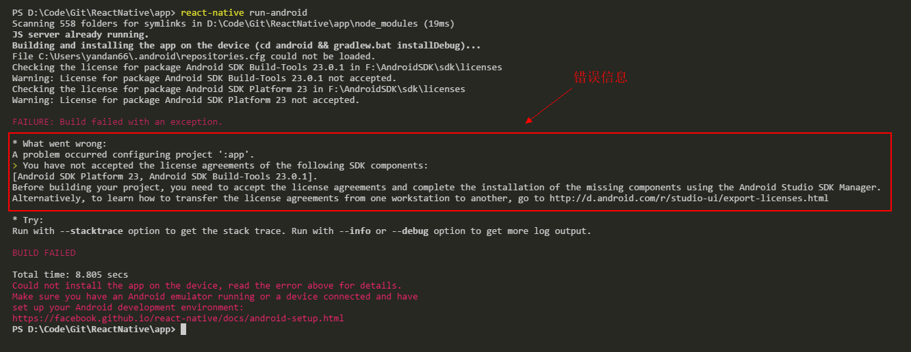
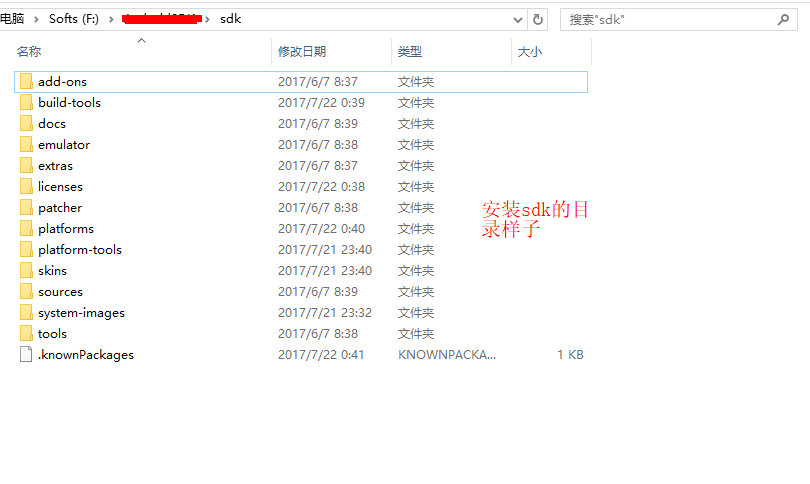
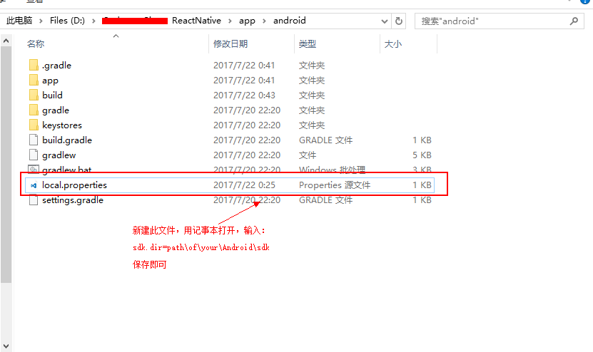
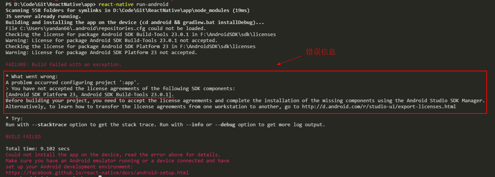
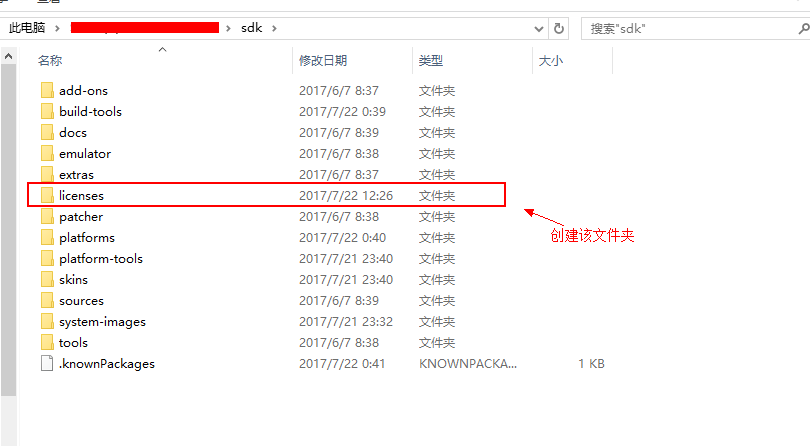
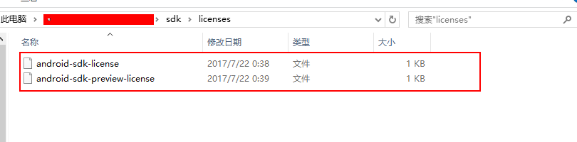
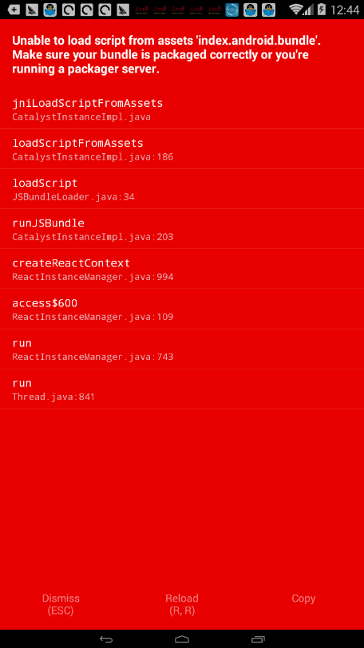
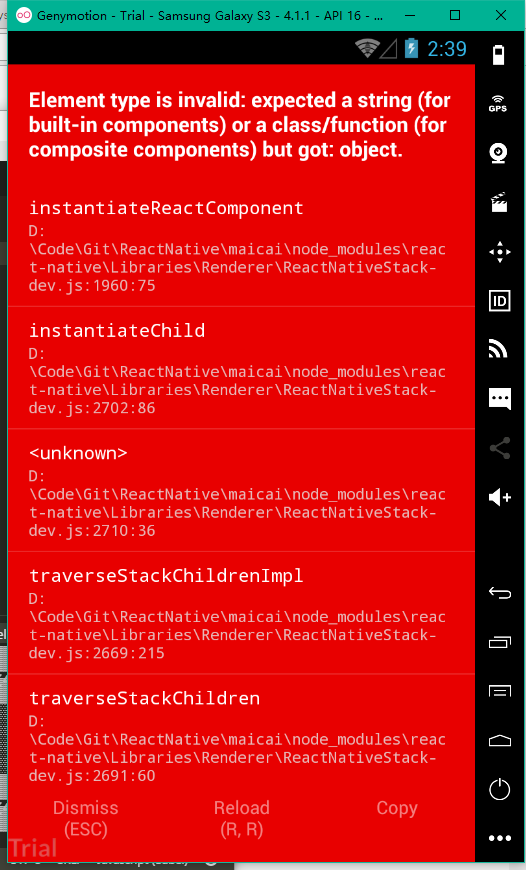
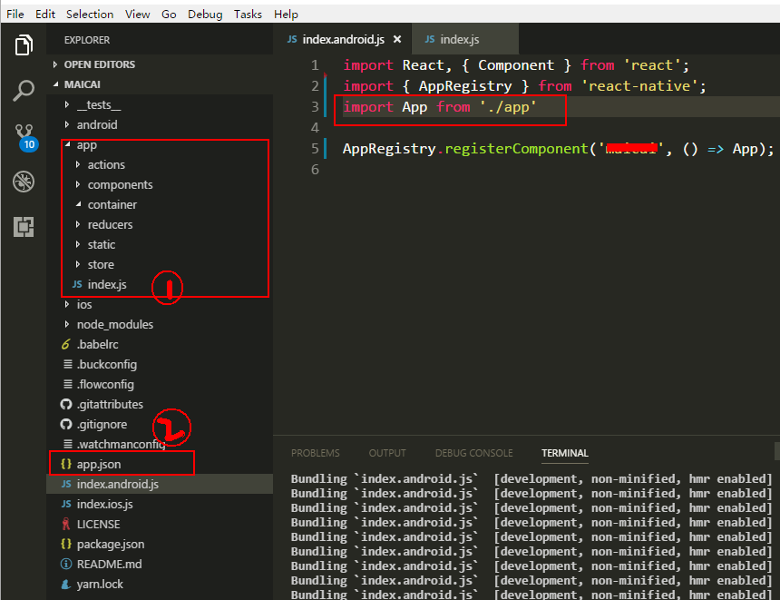

最近准备搞搞React Native, 跑个`Hello World`就遇到各种各样的坑。在`google`上找了半天，虽然有答案，但是答案中有各种坑。本文主要开发环境是`Windows 10 x64`专业版。
<!--more  -->


### 1. react-native init testProject always fails with unexpected token.

解决方案: 升级`node.js`到最新版本
见这个答案：[#15040](https://github.com/facebook/react-native/issues/15040)
<br />
### 2. `react-native run-android`相关

#### Can't find SDK despite setting ANDROID_HOME, windows 10 


这种情况是找不`android sdk`路径引起的，所有手动设置路径即可：
方法二： 设本地变量：
找到你创建项目下的`android`文件夹，在这个目录的下创建一个文件`local.properties`然后添加你`android sdk`的路径：
```
//填入sdk地址
sdk.dir=path\of\your\Android\sdk
//`window`下注意目录结构的写法
sdk.dir=path/of/your/Android/sdk
```



方法二： 执行命令带上参数（该方法试过，不起作用，不知道是不是没设置对）：

```bash
react-native run-android ANDROID_HOME="C:\Users\xxx\AppData\Local\Android\sdk" 
```

**注意：**
- `windows`环境下，目录路路径要采用`/`连接，而不是`Linux`下的`\`, （这个坑可以说是巨坑无比）。
- 参考[stackoverflow](https://stackoverflow.com/questions/32634352/react-native-android-build-failed-sdk-location-not-found)，主要注意`Windows`下目录路径的问题，参加上一条注意点。

<br />

#### 3. 问题：` You have not accepted the license agreements of the following SDK components`

<br />
出现这种问题，其实是你的`android sdk`下缺少`licenses`文件夹，解决方案为：
1. 在sdk根目录下创建`licenses`文件夹;
2. 在`licenses`文件夹下创建两个文件：`android-sdk-license`与`android-sdk-preview-license`;
3. 在`android-sdk-license`中写入：`8933bad161af4178b1185d1a37fbf41ea5269c55`;
4. 在`android-sdk-preview-license`中写入：`84831b9409646a918e30573bab4c9c91346d8abd`。


<br />

### 4. `adb`连接`android`模拟器相关
在使用`adb`连接模拟器调试的时候，一般会使用下面的语句:
```
adb connect 127.0.0.1
```
这句命令默认会连`5555`端口，**谷歌官方模拟器**就是用这个端口，但是这些国产模拟器用的端口却不一样，下面是一些模拟器的连接方式：

```
夜神模拟器   adb connect 127.0.0.1:62001
海马玩模拟器  adb connect 127.0.0.1:53001
```
**注意：**
- 夜神模拟器连接参考[这里](http://shadow000902.space/2016/03/21/adb%E8%BF%9E%E6%8E%A5%E5%A4%9C%E7%A5%9E%E6%A8%A1%E6%8B%9F%E5%99%A8/)
- 海马玩模拟器连接参考[这里](http://www.ieclipse.cn/2016/09/19/other/haimawan-adb/index.html)

<br />

### 5. 错误`unable to load script from assets index.android.bundle on windows`


解决方案: 在`android/app/src/main/`文件夹下手动创建`asset`资源:

```bash
mkdir android/app/src/main/assets
react-native bundle --platform android --dev false --entry-file index.android.js --bundle-output android/app/src/main/assets/index.android.bundle --assets-dest android/app/src/main/res
react-native run-android
```
见这个答案：[stackoverflow](https://stackoverflow.com/questions/44446523/unable-to-load-script-from-assets-index-android-bundle-on-windows)

<br />

### 6. `import`时设置`index.js`无法识别问题


产生这个问题的原因主要是因为同一层目录下有相同的文件及文件夹名。如`app.json`和`app`文件夹。


见这个答案：[#12539](https://github.com/facebook/react-native/issues/12539)